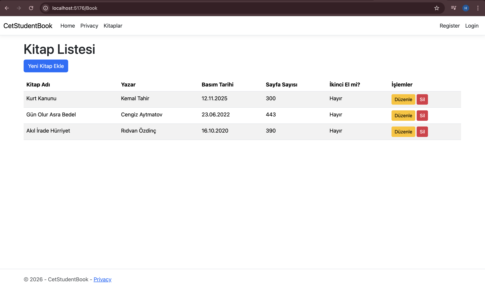
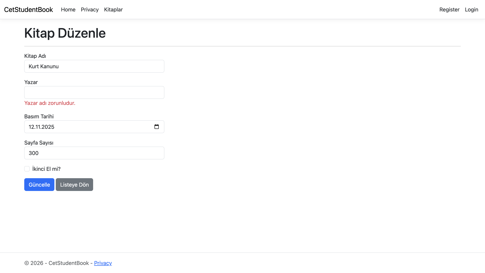
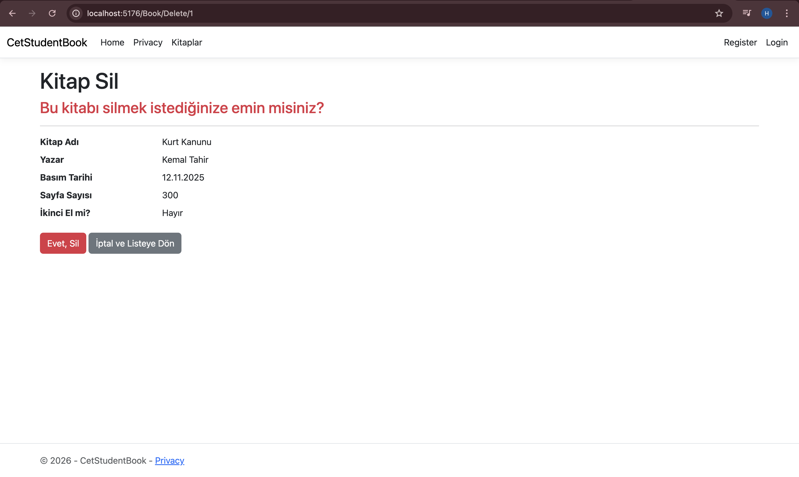

# CetStudentBook - Assignment: Books CRUD

Bu projede, kitap yönetimini sağlayan tam kapsamlı bir CRUD sistemi (Listeleme, Ekleme, Düzenleme, Silme) manuel olarak geliştirilmiştir.

## Yapılan İşlemler
* **Model:** Validasyon kuralları eklenmiş `Book` modeli oluşturuldu.
* **Veritabanı:** EF Core Code First kullanılarak `Books` tablosu oluşturuldu.
* **CRUD:** Controller ve View katmanları Scaffolding kullanılmadan manuel yazıldı.
* **Navigasyon:** Ana menüye "Kitaplar" linki eklendi.

## Projeyi Yerel Bilgisayarda Çalıştırma
1. Projeyi bilgisayarınıza indirin (Clone).
2. Terminali proje klasöründe açın.
3. Veritabanını oluşturmak için: `dotnet ef database update`
4. Projeyi başlatmak için: `dotnet run`
5. Tarayıcıda `http://localhost:5xxx/Book` adresine gidin.

## Ekran Görüntüleri
### 1. Kitap Listesi

### 2. Validasyon Hatası (Düzenleme Ekranı)

### 3. Silme Onay Ekranı

